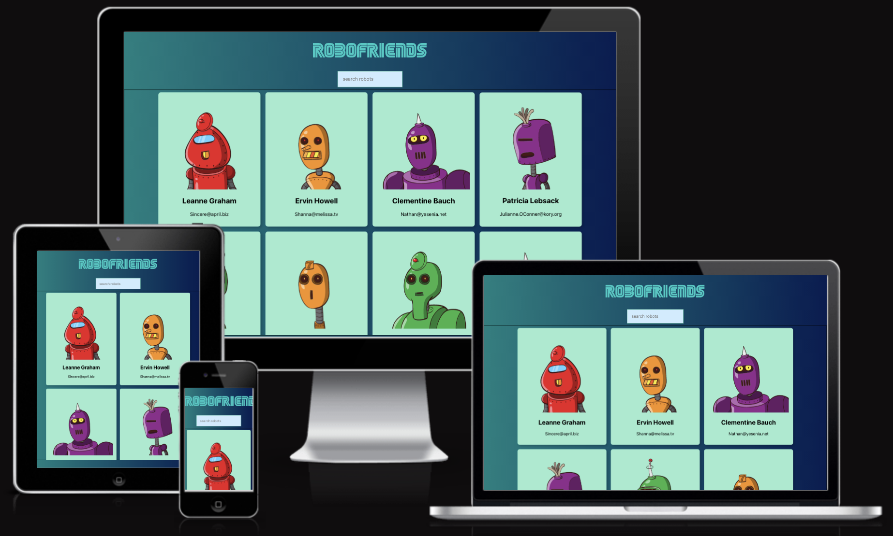
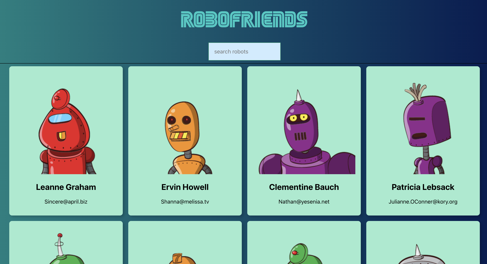

---

# **ROBOFRIENDS**
This is a simple website built using Create React App.

[Link](https://marcgithub23.github.io/robofriends/) to the website.

---

## Technologies Used

- HTML
- CSS (Tachyons)
- JavaScript + JSX
- React (Create React App)
- API
- VSCode
- Git
- GitHub

---

## Homepage

The homepage contains the logo, search box, and card list that displays image, name, and email address.

---

## Manual Testing

| Feature | Action | Expected Result | Y/N | Comments |
| --- | --- | --- | --- | --- |
| Homepage | Access website link | Display card list in a grid with name and email | Y | N/A |
| Search box | Type in name to search | Filter card list to show corresponding search | Y | N/A |
| Card | Hover or click | Animate for interactivity | Y | N/A |

---

## Deployment

The website was deployed to GitHub Pages. The steps to deploy are as follows:

1. Add `homepage` to `package.json`
`"homepage": "https://myusername.github.io/my-app",`

2. Install `gh-pages` in the terminal
`npm install --save gh-pages`

3. Deploy to `scripts` in `package.json` by adding `predeploy` and `deploy` as below
`"scripts": { "predeploy": "npm run build", "deploy": "gh-pages -d build" }`

4. Deploy the site by running `npm run deploy` in the terminal

5. Make sure GitHub Pages option in your GitHub project settings is set to use the `gh-pages` branch

## Credits

This was coded along the project walkthrough by Andrei Neagoie on [ZTM](https://zerotomastery.io/) in the React.js Fundamentals section of the Complete Web Developer in 2024: Zero to Mastery course.

The robot images were randomly selected via API from [robohash](https://robohash.org/).

## Reflective Learning

This was my first foray into React. I learned the following concepts:

- **Components:** building blocks of a React app, which are small, reusable parts that can be assembled to create UIs.
- **Containers:** smart components that manage state or interact with logic (like fetching data from an API).
- **One way data flow:** data moves from the top to the bottom of the component hierarchy.
    - **State:** represents the dynamic data in a component, like user input or fetched data.
    - **Props:** a way of passing data from a parent component down to a child component. A parent component (like a container) can pass its state or other data to child components via props, but the child component can’t modify the prop.